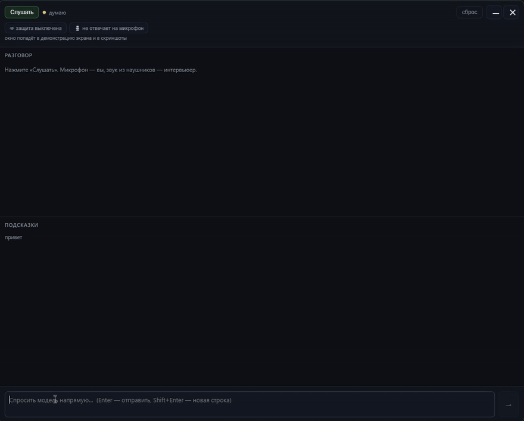

# Answerline

<p align="center">
  
</p>

<p align="center">
  
</p>

<p align="center">
  <a href="#что-это">Что это</a> · <a href="#быстрый-старт">Быстрый старт</a> · <a href="#свой-rag-корпус">Свой RAG</a> · <a href="#горячие-клавиши">Клавиши</a>
</p>

<p align="center">
  <a href="https://github.com/HerpBac9/answerline/stargazers"></a>
  
  
  
  
</p>

## Что это

ИИ-помощник, который работает на вашем компьютере. Он слушает разговор, а
микрофоном улавливает ваши уточнения — и отвечает локальной моделью **по вашему
RAG-корпусу**, а не по памяти модели. Ничего не уходит наружу: эмбеддинги, поиск
и генерация происходят на вашем железе.

На вопрос из наушников прилетает ответ в оверлей поверх окон. Он **не
озвучивается** — этого никто не услышит.

- **Учёба.** Корпус — ваши конспекты и разобранные задачи. Ответ опирается на них,
  а не на догадки модели.
- **Собеседование.** Наушники ловят вопросы интервьюера.
- **Рабочий созвон.** Второй участник спрашивает про то, что обсуждали часом
  раньше, — и это уже есть в корпусе.

Разделение говорящих физическое: системный аудиоканал — это тот, кого вы
слушаете, микрофон — это вы. Диаризация не нужна.

## Быстрый старт

```bash
npm install
npm run doctor     # проверяет LM Studio, Qdrant и пути — запустите первым
npm run dev
```

**Что нужно поставить заранее:**

| Что | Зачем |
|---|---|
| [LM Studio](https://lmstudio.ai) с загруженной моделью и запущенным сервером | генерация ответов и эмбеддинги |
| [Qdrant](https://qdrant.tech) | векторный поиск по корпусу |
| Собранный [whisper.cpp](https://github.com/ggml-org/whisper.cpp) и модель | распознавание речи |
| Windows 10+ или macOS 14.4+ | платформа |
| Наушники | без них собеседника слышно в ваш канал |

Пути к whisper.cpp и модели, коллекция Qdrant и модель эмбеддингов задаются в
`config.json`. Он создаётся при первом запуске: `%APPDATA%\answerline\config.json`
в Windows, `~/Library/Application Support/answerline/config.json` в macOS.
Почти все проблемы при первом старте — это неверный путь в конфиге, и `doctor`
показывает их сразу.

> **Длина контекста в LM Studio держите на 8192–16384.** На видеокарте 8 ГБ
> максимальный контекст вытесняет KV-кэш в оперативную память, и скорость падает
> с ~56 токенов/с до 2–12. Подробности и таблица замеров — в
> [docs/performance.md](docs/performance.md).

На macOS при первом запуске разрешите микрофон и **System Audio Recording** в
System Settings → Privacy & Security. Чтобы проверить всё в одиночку, скопируйте
`.env.example` в `.env` и поставьте `ANSWERLINE_ANSWER_FROM_MIC=1` — тогда вопрос
в микрофон тоже вызывает ответ.

## Свой RAG-корпус

**Без этого приложение бессмысленно: отвечать не по чему.** Папка `data/` в
репозитории пустая и не отслеживается git — наполните её сами.

Формат простой: Q&A по темам. Каждый заголовок `##` — отдельный вопрос, текст до
следующего заголовка — ответ.

```markdown
# Мой проект

## Что вы делали в проекте X?

Отвечал за интеграцию с ERP, вёл 6 релизов.

## С чем была самая сложная задача?

Реконсиляция остатков между двумя системами.
```

Проиндексировать:

```bash
npm run rag:index
# после удаления или переименования записей:
RAG_RECREATE=1 npm run rag:index
```

Что стоит помнить:

1. **Цифры, даты и названия — в файлы, а не в голову.** Локальная модель охотно
   их выдумает, если не найдёт в базе.
2. Одна тема = один подраздел, 100–400 слов.
3. Заголовки формулируйте так, как спросил бы человек, а не как названия
   разделов документа.

Файлы с личным опытом помечайте в YAML front matter строкой
`authority: internal_project` — по этому полю рантайм отбирает персональные
записи и не смешивает их с общими. Подробный формат — в
[docs/rag-index.md](docs/rag-index.md).

## Горячие клавиши

| Клавиши | Действие |
|---|---|
| `Ctrl/Cmd+Shift+\` | показать/скрыть окно |
| `Ctrl/Cmd+Shift+P` | пауза захвата |
| `Ctrl/Cmd+Shift+Enter` | отправить последнюю реплику как вопрос |
| `Esc` в поле ввода | остановить генерацию |

## Звёзды

<p align="center">
  <a href="https://star-history.com/#HerpBac9/answerline&Date">
    
  </a>
</p>

## Ещё

- Операционные команды — [`command.md`](command.md)
- Как устроен индекс — [`docs/rag-index.md`](docs/rag-index.md)
- Что не проверено — [`docs/project-status.md`](docs/project-status.md)
- Как помочь проекту — [`CONTRIBUTING.md`](CONTRIBUTING.md)

Лицензия [MIT](LICENSE) © 2026 HerpBac9.