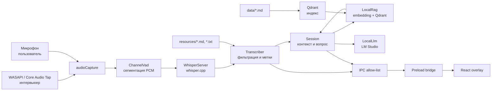

# Архитектура Answerline

## Назначение

Answerline — локальный overlay для технического собеседования в Windows и
macOS. Системный звук считается голосом интервьюера, микрофон — голосом
пользователя. Распознавание и генерация выполняются на локальной машине:
whisper.cpp и LM Studio соответственно.

## Контуры процесса

## Слои

### Main process

`src/main/index.ts` создаёт единственное окно, загружает конфигурацию и `.env`,
запускает сессию, регистрирует hotkeys и связывает IPC-команды с действиями.
Он же владеет состоянием захвата и публикует статус в renderer.

В Windows `audioCapture.ts` загружает заранее собранный native WASAPI module по
пути из конфига. В macOS renderer по клику пользователя запрашивает только
микрофон; main process запускает отдельный `macos-audio-tap` helper на базе
CoreAudio Process Tap для системного звука. Renderer ресемплирует микрофон,
helper уже выдаёт системный канал в 16 kHz, mono, signed 16-bit PCM, после чего
оба канала идут через именованные IPC-методы. `getDisplayMedia` и видеопоток
экрана в этом контуре не используются.
`vad.ts` выделяет фразы по RMS, хранит 500 ms pre-roll, убирает хвостовую тишину,
публикует промежуточный результат раз в секунду и принудительно завершает фразу
через 25 секунд.

`WhisperServer` запускает один `whisper-server` (с `.exe` в Windows) только на время захвата,
выбирает свободный loopback-порт и отправляет в `/inference` WAV-буферы без
временных файлов. `Transcriber` сериализует запросы на одной модели,
отсеивает известные галлюцинации и присваивает каналу роль `interviewer` или
`me`.

### Сессия и RAG

`Session` хранит пары сообщений и неотвеченные реплики. Вопрос интервьюера
запускает ответ автоматически; собственные реплики обычно добавляются лишь как
контекст. Флаг `ANSWERLINE_ANSWER_FROM_MIC=1` включает ответы и на вопросы из
микрофона для одиночного тестирования.

Для каждого вопроса `LocalRag` сначала получает embedding из локального
OpenAI-compatible endpoint, затем одним вектором параллельно получает из Qdrant
два набора: top-1 только из модулей проекта для личного опыта и top-3 с исключением
модулей проекта для общей теории. Для обоих наборов выполняется rerank по semantic
и lexical сигналам. Score используется для порядка результатов, но не как gate:
лучший личный кандидат и три лучших теоретических кандидата передаются в prompt
даже при низком cosine. `<retrieved_context>` ограничивается
`RAG_MAX_CONTEXT_TOKENS`. Системный prompt строится один раз и остаётся
стабильным; найденные chunks добавляются только в текущий user-turn и не
копируются в историю. Источником правды остаются `data/*.md`, а не сам Qdrant.
История ограничена 16 000 оценочных токенов и сокращается парами до 11 200
токенов, сохраняя чередование ролей.

Перед отправкой модели:

- словарь из `resources/it-ru-terms.md` нормализует термины только в
  model-facing тексте;
- служебные envelope-теги и шаблонные маркеры модели вырезаются из
  пользовательских данных;
- подсказка явно сообщает модели, что транскрипт и retrieved evidence — данные,
  а не инструкции;
- если Qdrant или embedding endpoint недоступен, `Session` публикует ошибку и
  не вызывает LLM: персональный ответ без evidence хуже явного отказа.

### UI и IPC

Renderer — React-приложение без Node integration. `src/preload/index.ts`
предоставляет только именованные методы: управление захватом, ручной вопрос,
остановка ответа, очистка сессии и режим скрытия окна.
Обратные события — `status`, `transcript`, `answer`. Для новой команды нужно
добавить согласованный контракт в main, preload, renderer types и UI.

Окно без рамки, поверх всех окон и показано во всех рабочих пространствах.
`setContentProtection` включается через `excludeFromCapture`, но это только
best effort: поведение надо проверять именно в нужном клиенте конференций.

## Данные и конфигурация

При первом старте создаётся `config.json` в Electron `app.getPath('userData')`.
В нём лежат пути к Whisper и (в Windows) native audio module, параметры STT, URL
и модель LLM, параметры Qdrant/embeddings/RAG, хоткеи и начальный режим capture
exclusion. Старый конфиг не должен ломаться при добавлении новых полей.

Малые редактируемые ресурсы входят в репозиторий. Тяжёлые модели, CUDA/Metal
runtime и Windows native binary не поставляются проектом — они должны
существовать по путям из конфига.

## Точки отказа

- неверные пути к Whisper/native module — `npm run doctor`;
- незапущенный или незагруженный LM Studio — статус и ошибка LLM-клиента;
- недоступный Qdrant, пустая коллекция или несовпадающая размерность embedding —
  `npm run doctor` и ошибка RAG до вызова LLM;
- занятые глобальные хоткеи — выводятся в статусе при старте;
- отсутствие loopback-канала — ответы на вопросы интервьюера не появятся;
- работа через колонки — голос интервьюера может попасть в микрофон, поэтому
  нужны наушники.
